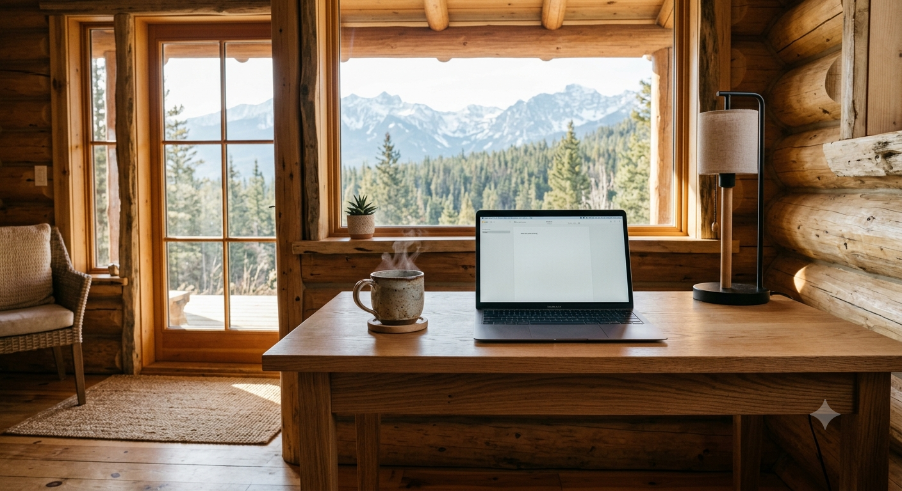

<figure><figcaption>AI-generated image of a minimalist in a mountain cabin</figcaption></figure>

Recently, I read [a post by Manuel Moreale](https://manuelmoreale.com/thoughts/downsizing) that inspired me to think seriously about downsizing my own personal project load. Just the very thought of downsizing feels like dreaming about fresh mountain air when you’re stuck in a city of pollution. The prospect of a breath of clean air inspired me to take concrete steps in that direction, the first of which was taking stock of what my project situation currently looks like.

It’s really amazing how many projects I seem to have going on at any given time. At the moment, I can count **eleven** active programming projects, **three** active writing projects and **three** renovation projects on our home. That’s not even including the projects I actively work on for my job or the regular chores, household responsibilities and fatherly duties that occupy much of my non-working time. Oh, and did I mention I currently have **twelve** domain names I’m paying for, some of which don’t even have active websites behind them because I optimistically bought them thinking that a project might get far enough along to actually release?

The main focus of this post is going to be my personal programming projects which I’m currently inundated with. I tend to start a lot of them, then abandon them as my interests wax and wane. That means I end up with a graveyard of hardly finished, half-finished and mostly finished projects that never actually see the light of day. One day, I’ll work on one of them, then shift gears the next day to another one, but then decide an hour later to start a brand new one because the creative muse suddenly struck the back of my head with its cudgel. Two days later, I’ll pick up an old one again, but then just as quickly abandon it once more. And on and on it goes. Some go for years without seeing any activity while others, like this blog, get regular updates.

It sounds crazy, but it gives me a safe space to experiment with new technologies, new ideas, new archictectures and new methodologies. I don’t think I’ll ever stop doing it because my curiosity won’t (and shouldn’t) be tamed. However, it also means I have to clean house every once in a while.

The first thing I’m going to do is cancel all domain names I’m not actively using. The next thing will be to “archive” all of my inactive projects as well as the projects I’ve decided to no longer work on. That involves moving everything from my MacBook to an “archive” folder on the 4 TB hard drive on my desktop PC. This not only frees up space on my primary machine (my MacBook), but also cleans up mental space. Most of them are also on [GitHub](https://github.com/eiskalteschatten) which means I will also archive those repositories.

This whole process isn’t anything new for me, but it is the first time I’ve written about it that I can recall. That said, what makes this time different is that I’m thinking it’s time to clean up some of my older *released* projects that have been around in some cases for decades. One such example is my history blog, [History Rhymes](https://www.historyrhymes.info). I started it in 2008 and actively posted until about 2019/2020. I’ve been hosting and maintaining it now for years without actually doing anything with it. So, I’ve been thinking about shutting it down.

While I would import the posts into this blog and set up redirects so that the posts are preserved, shutting the blog down will free up some mental space in my head. In the end, it’s really about consolidation. The less active sites I have, the less overhead I have. It’s the same with my [German blog](https://blog.alexseifert.de). I hardly write anything on it, so why keep it around as a separate entity and add to my maintenance overhead? Instead, I’ll just import the posts into this blog too and shut it down as well. That’s two of the four blogs I currently have to maintain — a 50% reduction of maintenance overhead and mental bandwidth.

I’ve already staged this scenario locally by running a WordPress instance in a Docker container using a recent database dump from this blog. I then took the WordPress export files from both History Rhymes and my German blog, customized the tags and categories manually in the XML, then imported them locally. I repeated this process until they imported cleanly with the right tag/category mixture that felt right to me. In essence, I’m ready to do it and just need to pull the import trigger.

At some point in the future, I may consolidate [the last remaining blog](https://www.the-beskirted-man.com) into this one as well and just have one single blog for everything, but that won’t be for quite some time, if I do it at all.

Other contenders for consolidation are my [portfolio site](https://www.alexseifert.com) and this blog. I’ve always kept them separate using WordPress for my blog and whatever flavor of interesting technology happens to be tickling my tongue at the moment to power my portfolio site. I’ve used Frontpage 2000, plain HTML (pre-CSS), ASP (pre-.NET), PHP, Java, Node.js (with and without TypeScript), and Next.js (which is currently powering it). Most iterations used vanilla PHP or PHP with [Symfony](https://symfony.com).

That said, I’m thinking it’s about time for WordPress to power it for the first time ever. While not glamorous or exciting, it would allow me to consolidate the two websites into a single entity. I use a fully custom theme for my blog anyway which gives me absolute control over the design and what I can do with it. By creating custom templates combined with CSS and JavaScript, I can do just as much with a WordPress page as I can with any other PHP page. In fact, a lot of the pages on this blog are already custom templates with content fully maintained in code rather than the CMS proper. Even the [Sitemap page](https://blog.alexseifert.com/sitemap/) is generated automatically by code. I only use the CMS to power the blog and a few of the basic pages like the Privacy Statement.

But I digress. There are a couple of other released projects like [Haunted House Software](https://www.hauntedhousesoftware.com) I may just shut down entirely or consolidate into this blog and/or my portfolio site without any fanfare whatsoever. We’ll see. The real point is that I want less. I only want what’s most important to me right now and everything else can be shut down, consolidated and archived.

Planning and executing such consolidation processes takes its own effort and mental spaces, but once it’s done, it will feel enormously refreshing — like a breath of fresh mountain air.