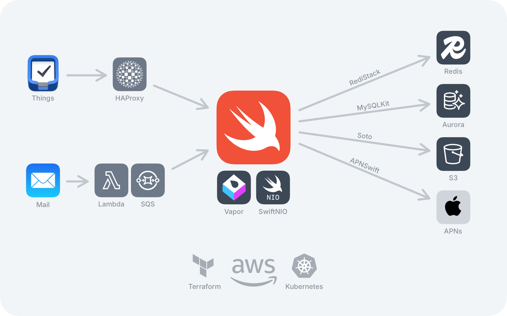

<figure><figcaption>Swift-based architecture for Things Cloud</figcaption></figure>

Ever since [I experimented with the Swift server-side framework Vapor](https://blog.alexseifert.com/2025/06/29/experimenting-with-the-swift-web-framework-vapor/) last year, I’ve been interested in actually seeing it in operation in the wild. I know there have been a number of companies, including Apple itself, that have started using it for their server-side applications, but it’s nice to see some concrete examples of it.

I’ve been following the [official Swift blog](https://www.swift.org/blog/) for a while now, but I just recently discovered two posts about companies that are using Swift and Vapor at large scale to run their server-side applications.

The first of which is the syncing service for the very popular Mac/iOS productivity application, [Things](https://culturedcode.com/things/). I’ve played around with Things before in the past, but it’s too expensive for my basic needs, so I don’t use it. Nonetheless, it is still a very popular application and the fact that Swift and Vapor power its syncing backend is great news for those who are questioning the framework’s reliability or scalability.

You can read more about Things using Swift and Vapor [here](https://www.swift.org/blog/how-swifts-server-support-powers-things-cloud/). The post also includes more information about their infrastructure in general.

The second usage I found recently was for the [TelemetryDeck analytics service](https://telemetrydeck.com). Unlike Things, I had never heard of them, so I can’t say a whole lot about them, but they apparently have a massive amount of traffic that Swift and Vapor handle flawlessly.

You can read about it [here](https://www.swift.org/blog/building-privacy-first-analytics-with-swift/).

Of course, something to keep in mind is that both of these posts are on the official Swift blog which is unlikely to report on any negative experiences that companies have had with server-side Swift. However, I still find it great that companies are having success with using Swift and Vapor in production environments with large traffic loads.

If you know of any other examples of server-side Swift in the wild, let me know. I’d love to read about it — good or bad!