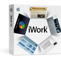

\[digg=http://digg.com/apple/iWork\_08\_and\_Microsoft\]I’m sure by now everyone who pays any attention to anything Apple-related or even computer-related has heard about (and even had enough of) Apple’s new iLife ’08 and iWork ’08. Well, to add insult to injury, here’s my two cents worth.

After having read quite a bit about the new software suites from Apple, I decided I would go out on a limb and try them myself. Keep in mind, I had iLife ’04 (the first version with GarageBand) and iWork ’06. I rushed out to the local Apple Retail Store (I was too impatient to order it online) and purchased both iLife ’08 and iWork ’08, even sacrificing my university student discount for time saved in getting a chance to play with them. It wasn’t until after the fact that I realized I had hurried to the store to purchase an office suite…

Anyway, what I really wanted to discuss here was the new version of iWork. To sum things up before I even get started, Microsoft should be embarrassed. For most users, the first thing they will notice is the price. At $79 for the entire suite (which includes Pages for word processing, the new Numbers application for spreadsheets and Keynote for slide shows and presentations), it’s **much** cheaper than the Standard Edition for Microsoft Office, which costs a whopping $399! The next thing users will notice is how beautiful the applications are. They, as would be expected from Apple, seamlessly fit Mac OS X’s Aqua look and feel. It also is noticeably more streamlined with all of the common features being only one or two clicks away than Microsoft’s clunky, outdated Office suite. For those of you who are more familiar with the technical aspects, Apple has beat Microsoft to the punch by supporting the new Open XML format. The Open XML format is used in Microsoft’s own Office 2007 for Windows. That means that iWork ’08 can read and write the default format for Microsoft Office 2007, but Office for Mac can’t. How embarrassing for Microsoft.

That’s about all I have to say about it. On a last note, if you haven’t tried it, but are interested in trying it, Apple has a free 30-day trial available for Mac users. You can find that here: [http://www.apple.com/iwork/trial](http://www.apple.com/iwork/trial).

There is also more information about iWork ’08 (including screenshots, etc) here: [http://www.apple.com/iwork](http://www.apple.com/iwork).