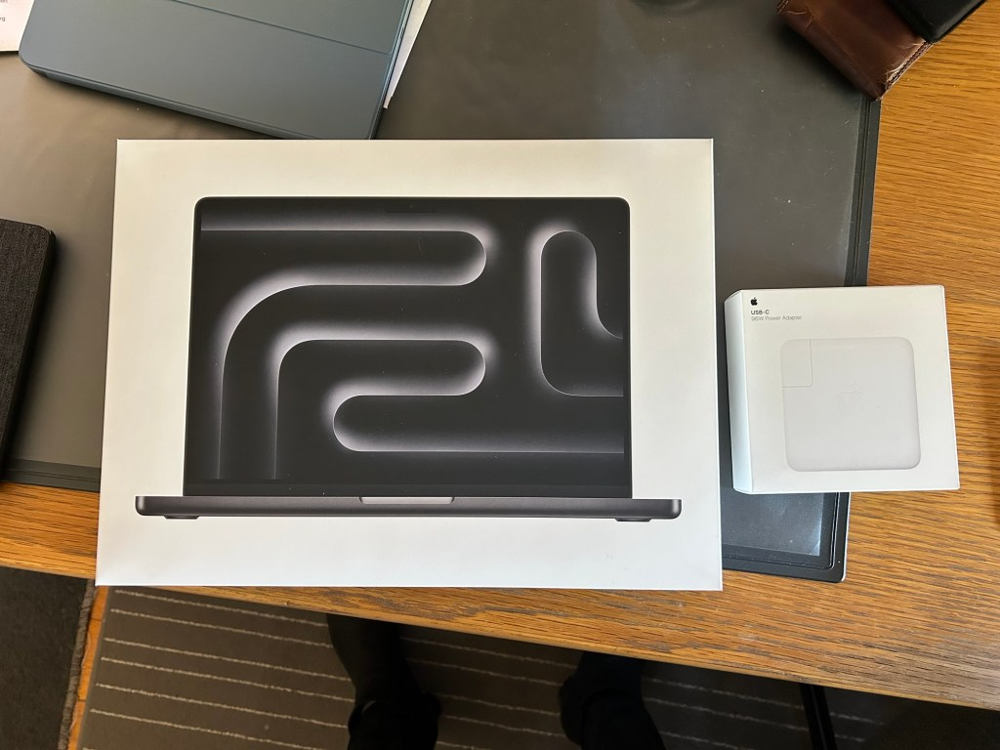
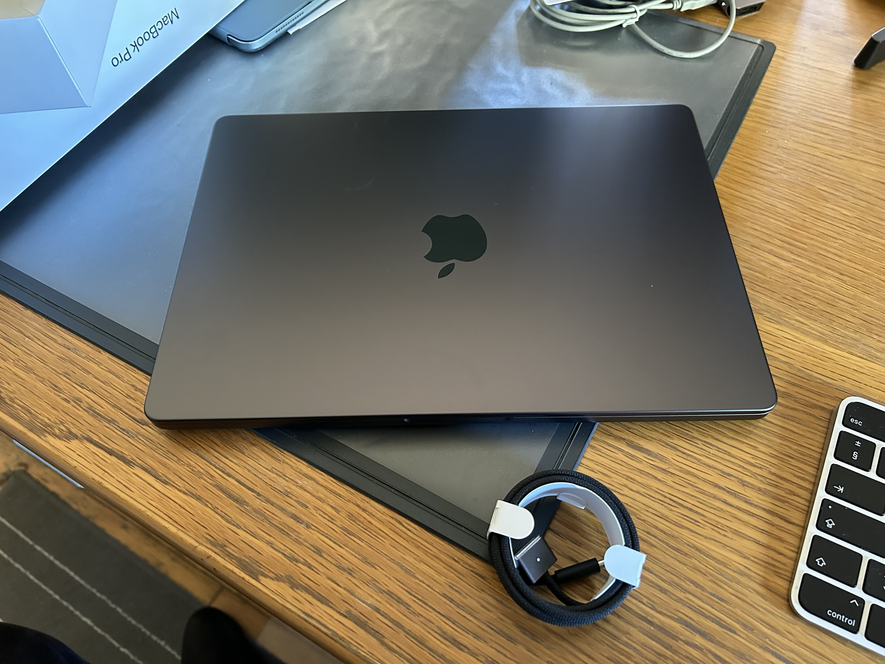
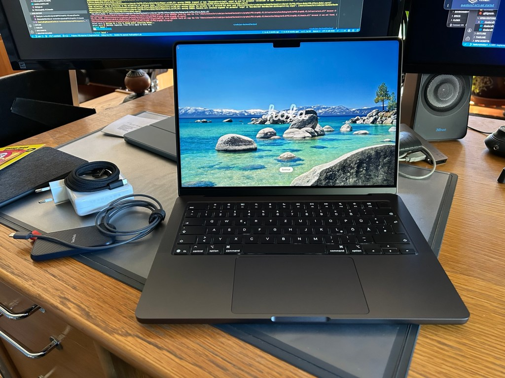
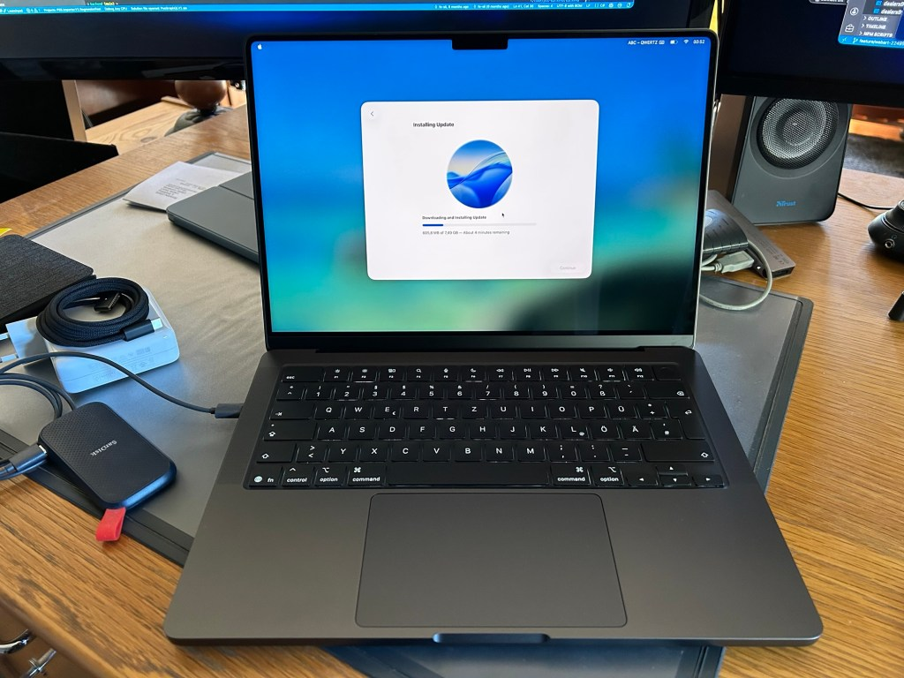
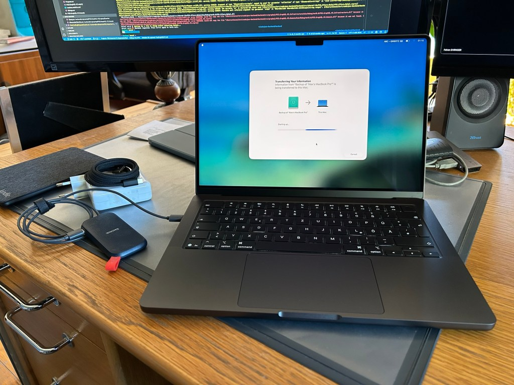

Well, I finally got a new MacBook Pro. It’s my first brand new MacBook since I bought a 15″ MacBook Pro in 2014. I’ve been wanting to buy a new one for several months, but was unsure about whether I should wait for the rumored M6 MacBooks that will supposedly get a new lighter and thinner design later this year or just ignore the rumors and buy a new one now.

But once I found out that [cyberport.de](https://www.cyberport.de) had MacBooks on sale (I’m not sponsored), I decided that I couldn’t wait anymore and bought one. The basic specs are:

-   M5 chip
-   32 GB of RAM
-   2 TB SSD
-   14″ display

I got that for €2500 which is about €500 less than directly from Apple and essentially made the 2 TB SSD upgrade free. I also could have gone with a 16″ instead, but I decided I’d prefer a larger SSD. Most of the time I use it plugged into an external monitor anyway and when I’m traveling with it, I like the smaller, lighter form factor.

I did play around with the idea of getting a 15″ MacBook Air instead since the specs I care most about are the same, but in the end I decided the fans might be nice to have even though I’ll probably only rarely, if ever, need them.

Here are a few pictures:

<figure><figcaption>My new 14″ M5 MacBook Pro still sealed in the box</figcaption></figure>

<figure><figcaption>My new 14″ M5 MacBook Pro still unopened</figcaption></figure>

<figure><figcaption>My new 14″ M5 MacBook Pro’s first boot screen</figcaption></figure>

<figure><figcaption>My new 14″ M5 MacBook Pro installing macOS 26.4.1</figcaption></figure>

<figure><figcaption>My new 14″ M5 MacBook Pro transferring files from an external SSD with a Time Machine backup of my old 2019 MacBook Pro</figcaption></figure>