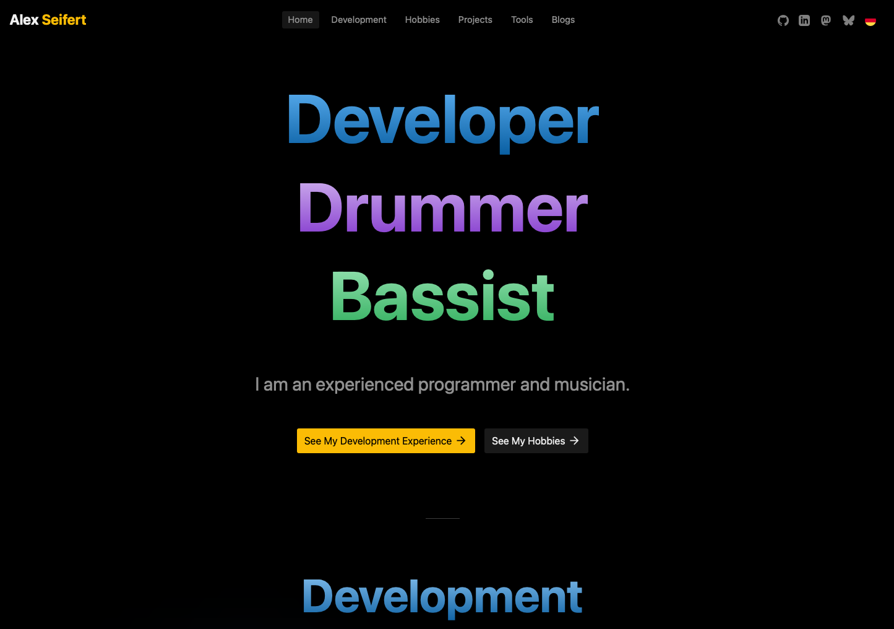

<figure><figcaption>AlexSeifert.com in September 2026</figcaption></figure>

For the past few months, I’ve been on a quest to replace [my portfolio website](https://www.alexseifert.com). I’ve already begun the programming process which, while it’s been fun, has also been plagued by indecision.

There are two goals I’m trying to pursue with a relaunch, both of which are related.

Firstly, my current portfolio page is based on the React framework, [Next.js](https://nextjs.org). I want to move away from that entirely and move back to a vanilla, dependency-free PHP-based site like I used for about 20 years before shifting to Next.js. I no longer want the maintenance burden of having to maintain a website based on any sort of JavaScript framework. Dependency-free PHP will run forever and ever without needing any updates beyond what my server’s package manger is responsible for which makes it the ultimate low-maintenance technology.

Secondly, I want to downsize my online presence and the number of projects I have to maintain. [I recently wrote about it.](https://blog.alexseifert.com/2026/07/31/downsizing/) I have several blogs and a few other websites that I don’t want to worry about anymore. Some I’ll just shut down, but others I would like to integrate into my portfolio site. Once such candidate is [Haunted House Software](https://www.hauntedhousesoftware.com).

Essentially, both goals can be distilled down to a strong need to reduce my project overhead. I want as little work as possible so that I can focus on what really matters to me without the mental overload of having to decide where to post what or whether this WordPress instance or that JavaScript framework needs updates or other maintenance.

I keep calling it my “portfolio site” which is what it currently is, but my intention is to expand it beyond just a portfolio and make it more of a central hub for my online presence. I’ve been heavily inspired by [Michael Harley’s website](https://michaelharley.net).

That said, I’ve been having issues deciding on how exactly to achieve that.

Troubles
--------

My first major problem is that I can’t seem to come up with a design that hits the sweet spot. I happen to really like the design I currently have, but it has never worked well on Safari for iOS/iPadOS. The interwoven gradients have always been too much for it to handle, even on powerful devices such as iPads with an M-class processor. Optimizations I’ve added unfortunately haven’t helped much. Even using a CSS trick to force the gradients onto a GPU compositor layer to speed up rendering and prevent it from re-rendering the expensive, complex gradients when they’re scrolled in and out of the viewport didn’t fully help. I haven’t written about how I did that yet, but I probably should one day since it’s a neat trick.

In any case, I feel entirely uninspired and can’t seem to figure out what I want the new version to look like. The design I’ve started with looks a little bit like this blog, but somehow more boring and plain. It’s true that I want something a bit simpler and have even considered something as simple as [Christian Cleberg’s website](https://cleberg.net), but I think that is a bit too sparse for me.

Design isn’t the only issue I’ve been stuck on: I can’t seem to decide which technology stack to settle on. I know I mentioned vanilla, dependency-free PHP above, but the other candidate is WordPress. At first, that seems to go against what I said about having a website that is as low-maintenance as possible, but the reality is that I’ve used WordPress for this blog since 2007 and the maintenance is largely automated with the WP CLI and cronjobs. So why would I consider it for my hub page?

Well, again, in the name of simplification. If I used WordPress, I would essentially take this exact WordPress instance, move it to the root domain instead of `blog.alexseifert.com` and combine and consolidate everything into it. Then I would only have a single application to worry about.

The alternative is, of course, to use vanilla PHP and eventually replace WordPress entirely with a solution using Markdown files for my blog posts. That would also allow me to achieve my objective of simplification and is the even simpler, more maintenance-free solution.

However, I do rather enjoy having a CMS. I’ve always found having to write my posts in Markdown, then upload them as well as any images to the server tedious. When I’m writing, I want it to be as frictionless as possible which means writing and hitting publish when I’m done. Also, I can do that from my iPad or my iPhone if I’m out traveling and don’t have my laptop with me. I don’t do that often, but I like to know I can.

Conclusion
----------

Regardless of the design and which technology stack I end up choosing, my main goal is consolidation. I want fewer sites, fewer maintenance burdens, and generally just a cleaner online presence. I feel drawn to the [IndieWeb](https://indieweb.org) and [smolweb](https://smolweb.org) movements, even if I’m not interesting in fully adhering to their guidelines. What attracts me is that both of them call for taking control over your online presence and only using the technologies you actually need as opposed to adopting whatever React-flavor-of-the-day is currently the most hyped just because the cool kids do it.

Unfortunately though, indecision has meant I’ve been stuck for the past few months with a partially finished project with constantly moving goal posts. Sometimes it feels like my experience working on greenfield projects at work has caused me to internalize the plague of indecision that kills most of them in corporate environments.

I’ll get there eventually, though. My strategy has been to just keep plowing on with a less-than-stellar design and using vanilla PHP instead of WordPress. I’m confident that a final version I’m more or less satisfied with will eventually emerge and then I’ll be glad I didn’t give up.