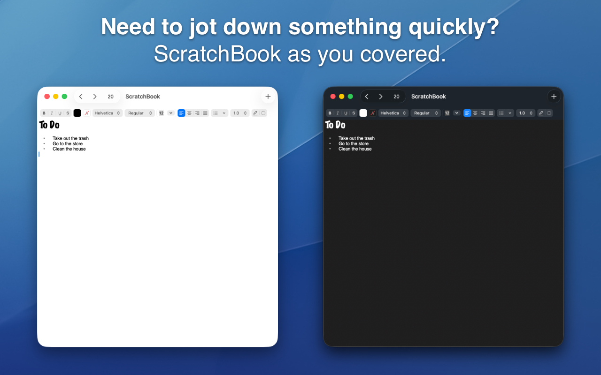

<figure><figcaption>ScratchBook screenshot</figcaption></figure>

I’m excited to announce that ScratchBook is now available as a free download on the Mac App Store!

If you are interested in downloading it, you can visit its page on the [Mac App Store](https://apps.apple.com/us/app/scratchbook/id6759719038).

I’m especially excited about this release because it is the first time I’ve published anything on any app store and because it’s a much needed update to the original ScratchPad whose Objective C codebase dates back to Mac OS X Tiger.

<figure></figure>