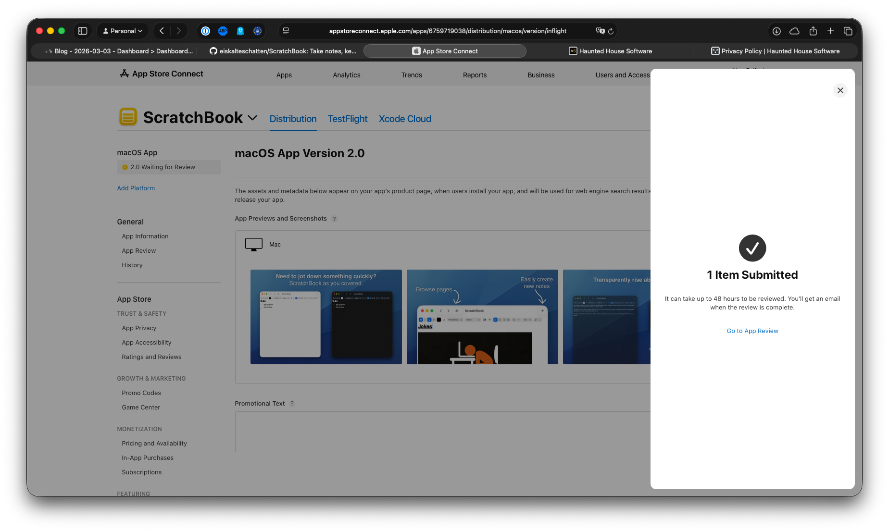
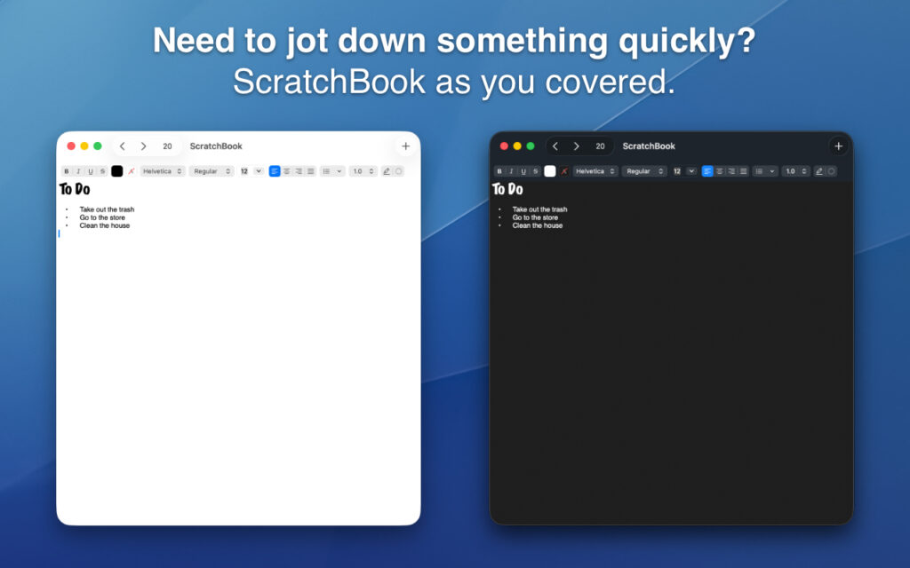
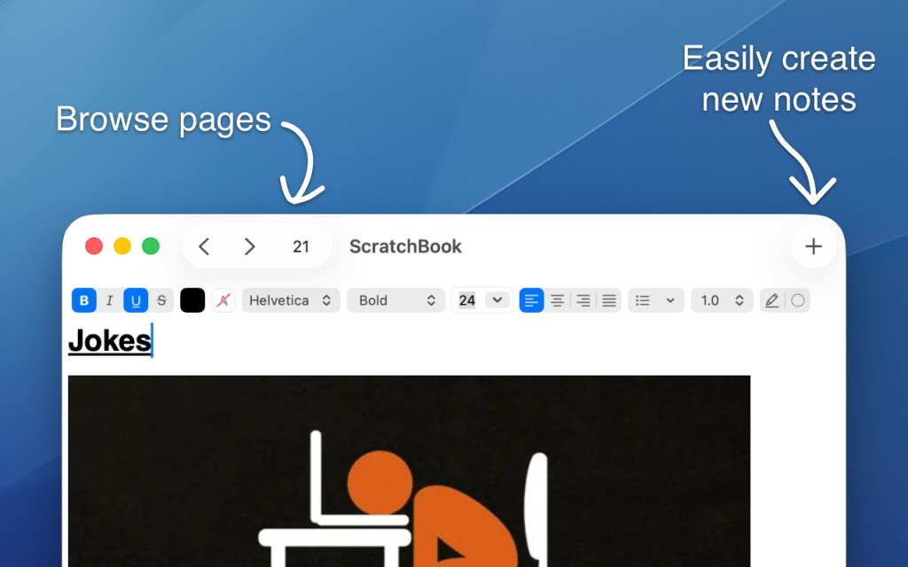
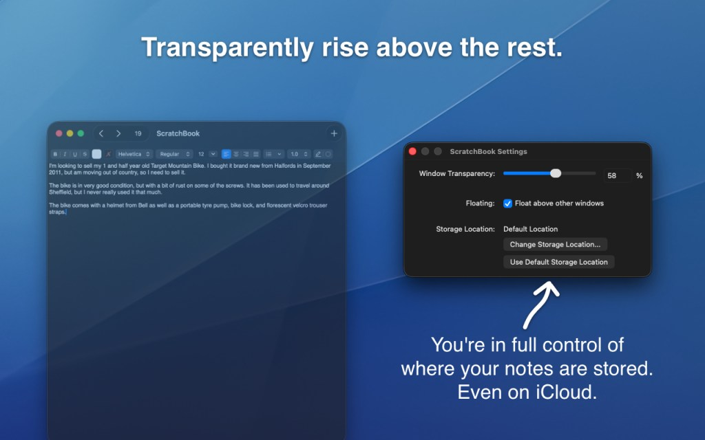
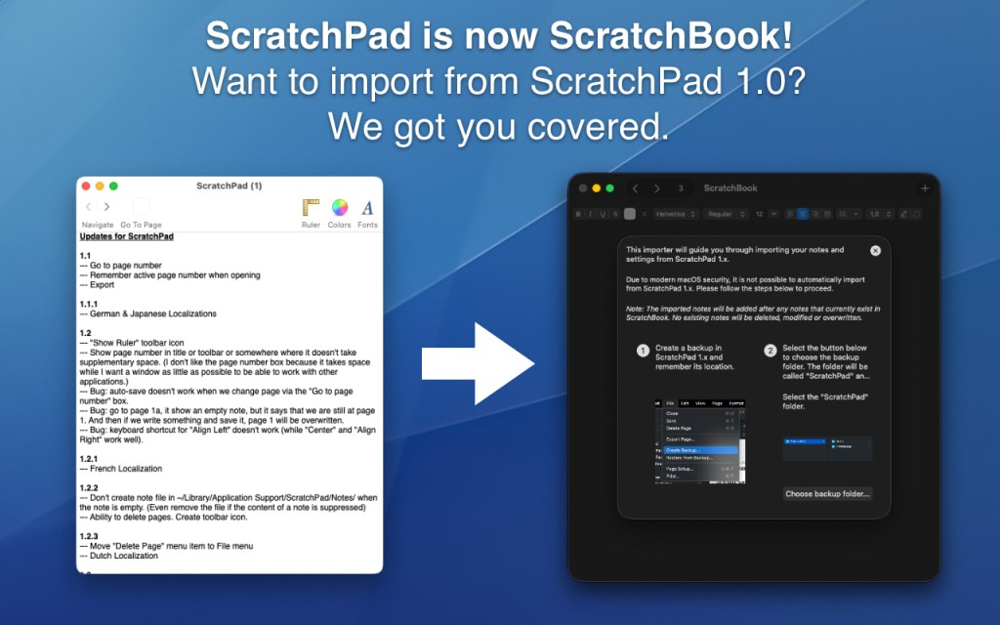

<figure><figcaption>ScratchBook submitted for review to the Mac App Store</figcaption></figure>

I’m excited to announce that I just submitted my very first app for review to the Mac App Store! Hopefully, all goes well and ScratchBook will be available for free soon. Of course, I’ll post about it when it is available to download.

As you may have noticed, I did decide to rename ScratchPad to ScratchBook in order to better distinguish it from another application in the Mac App Store called Scratchpad. I wrote about it in more detail [here](https://blog.alexseifert.com/2026/02/23/do-i-need-to-rename-scratchpad/).

In my opinion, the most tedious part was preparing the images and the text for the application description. This is the description I went with:

> Take notes, keep them organized. ScratchBook is a free, simple, easy-to-use, multi-page scratchpad application for macOS.
> 
> ScratchBook is version 2.0 of a small application that used to be called ScratchPad. This version is a complete rewrite from the ground up using modern macOS technologies such as SwiftUI. It runs natively on both Intel and Apple Silicon Macs and supports modern macOS features such as Dark Mode.
> 
> Features:
> 
> -   Jot things down quickly and simply: no choosing folders, adding tags or any other distractions.
> -   Multiple pages allow you to just add a new one when you need a new note. Your existing notes stay safe.
> -   ScratchBook takes advantage of macOS’s built-in rich text capabilities. You can change fonts, colors, add images, make lists, and so much more.
> -   Automatic saving.
> -   Notes are saved in TextEdit-compatible .rtfd files which can be stored anywhere on your Mac or iCloud.
> -   You can keep ScratchBook above all other windows for easier note-taking.
> -   You can make ScratchBook as transparent as you’d like to see what’s behind it while taking notes.
> -   Export individual notes as TextEdit-compatible .rtfd files.
> -   Import all your notes from ScratchPad 1.0.
> -   Full support for Liquid Glass, including both dark and light modes.
> -   Free and open source.

And, of course, here are the images:

<figure><figcaption>ScratchBook screenshot</figcaption></figure>

<figure><figcaption>ScratchBook toolbar screenshot</figcaption></figure>

<figure><figcaption>ScratchBook settings screenshot</figcaption></figure>

<figure><figcaption>ScratchBook import screenshot</figcaption></figure>

As a little easter egg, I used a section of the default wallpaper from Mac OS X Tiger as my background for these images in a nod to ScratchPad first being released for Tiger about twenty years ago.

It will certainly be interesting to see whether the application will be accepted or not. As always, I will keep you up-to-date here on my blog.