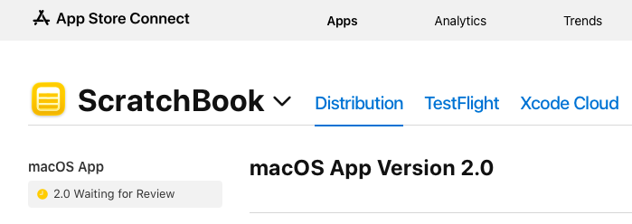
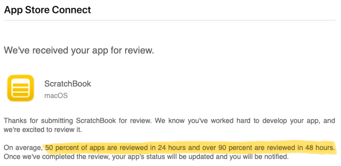

<figure><figcaption>ScratchBook waiting for review</figcaption></figure>

Unfortunately, ScratchBook is still waiting for review. Apparently, it’s tough to review a simple application. Most likely though, it just doesn’t have much priority. It’s a small, free application from an unknown developer that Apple isn’t going to make any money from.

I submitted it for review on Tuesday, March 3rd. According to the email I received from Apple confirming its submission, the average approval time for 50% of submitted apps is 24 hours and for 90%, it’s 48 hours:

<figure><figcaption>The average wait time for app reviews</figcaption></figure>

Apparently ScratchBook falls within that 10% where it takes much longer. I have no explanation for this as I have received absolutely not communication from Apple since its submission. No change in status, no emails, no notifications, deafening silence.

In any case, I’ll post again here when it’s been approved or denied.