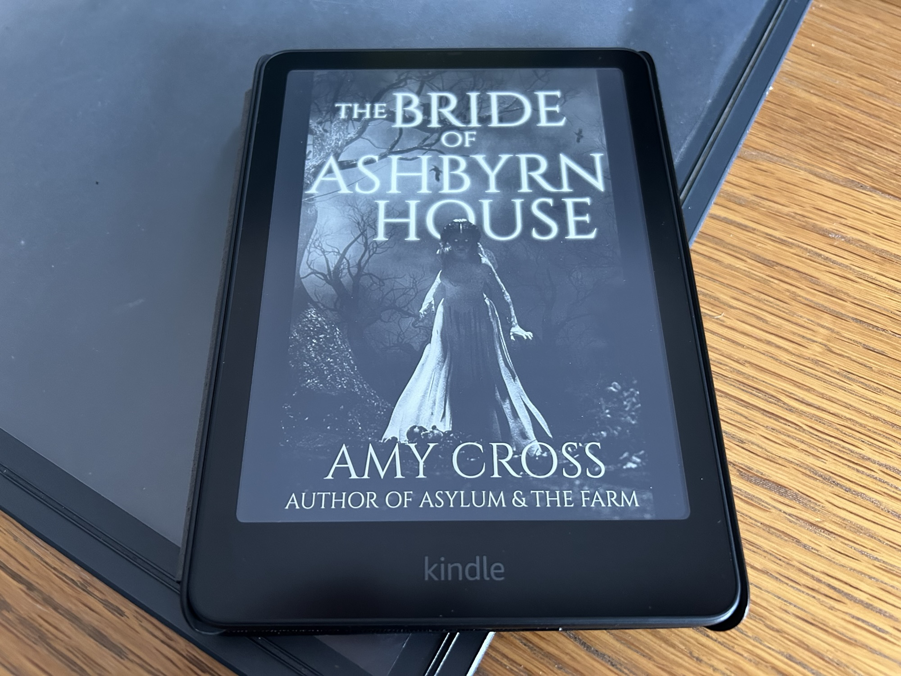

<figure><figcaption>The Bride of Ashbyrn House by Amy Cross</figcaption></figure>

Before reading *The Bride of Ashbyrn House*, I had never read anything by [Amy Cross](https://blog.alexseifert.com/tag/amy-cross/). Not only did the novel impress me, but it quickly became one of my all-time favorites. That’s an impressive feat for a new-to-me author to achieve after only a single book. As such, I knew I had to write about it next.

The story had everything I love about ghost stories: an old haunted manor, a vengeful ghost, an intriguing story and a sense of thrill that kept the pages turning. This time though, they were digital pages as I read it on my Kindle rather than as a paperback. As of this writing, it isn’t available in paperback form.

Here is the description of the book from [Goodreads](https://goodreads.com/book/show/32714766-the-bride-of-ashbyrn-house):

> “I have waited so long for your return.”
> 
> In the English countryside, miles from the nearest town, there stands an old stone house. Nobody has set foot in the house for years. Nobody has dared. For it is said that even though the lady of the house is long dead, a face can sometimes be seen at one of the windows. A pale, dead face that waits patiently behind a silk wedding veil.Seeking an escape from his life in London, Owen Stone purchases Ashbyrn House without waiting to find out about its history. As far as Owen is concerned, ghosts aren’t real and his only company in the house will be the thin-legged spiders that lurk on the walls. Even after he moves in, and after he starts hearing strange noises in the night, Owen insists that Ashbyrn House can’t possibly be haunted. But Owen knows nothing about the ghostly figure that is said to haunt the house. Or about the mysterious church bells that ring out across the lawn at night. Or about the terrible fate that befell the house’s previous inhabitants when they dared defy the bride. Even as Owen starts to understand the horrific truth about Ashbyrn House’s past, he might be too late to escape the clutches of the presence that watches his every move. The Bride of Ashbyrn House is a ghost story about a man who believes the past can’t hurt him, and about a woman whose search for a husband has survived even her own tragic death.
> 
> [Goodreads](https://goodreads.com/book/show/32714766-the-bride-of-ashbyrn-house)

Since I’m going to freely discuss the story, ***there will be spoilers!*** Continue at your own risk!

Recently, it feels like there has been an onslaught of horror stories that have to do with dead brides. I seem to see books and movies about them all over the place, but of all of them I have read or seen, *The Bride of Ashbyrn House* stands out as the best. The story primarily takes place at Ashbyrn House in Cornwall, England. It alternates between the events of 1859 when an upperclass woman named Katinka Ashbyrn is due to marry her fiancé, and the present when a man named Owen buys the allegedly haunted property. The further the story moves along, the clearer the bridge between the two time periods becomes.

Katinka
-------

The story begins from Katinka’s perspective. She is watching from the house as her husband comes up to the gates outside, sees her, then turns around and leaves, abandoning her. It immediately leaves the reader with a feeling of unease, a sense of sympathy for Katinka, and many questions. Fortunately, they are answered throughout the story, however, some of them not until the last few pages. The reader has no idea at this point that the opening scene takes place in the present.

Most of the story from Katinka’s perspective takes place in 1859, shortly before her planned wedding. She wants it to be absolutely perfect and nothing will stop her from getting what she wants. First and foremost, however, she is to be the picture-perfect centerpiece of it all. In her vanity, she commissions a portrait of herself which arrives shortly before the wedding. For the next several days, much of her time is occupied with sitting and admiring herself in the painting. Eventually, she convinces herself that she appears much more attractive in the picture than in real life which she won’t tolerate. Thus, she begins a strict regiment of self-mutilation to ensure she is skinnier and, in her mind, prettier — the perfect centerpiece for the wedding.

At this point in the story, it’s clear that she is a selfish, highly toxic person who doesn’t quite have all of her ducks in a row. Aside from what she does to herself, she practically worships her dead father while belittling and berating her mother and her younger sister, Pippa. Her fiancé is also subjected to torrents of verbal abuse which culminates in her catching him cheating on her in the pantry with Pippa. For that, Katinka murders her sister coldheartedly without so much as batting an eye.

Come the day of the wedding, all of the guests have assembled at Ashbyrn house. To make her grand entrance, Katinka has arranged to ride in a coach. However, as the coach rumbles down the rough driveway, tragedy strikes. Katinka, who has used a healthy dose of paraffin — a highly flammable substance — on her skin to make herself appear perfect, is jerked out of her seat and her face comes into contact with the candle lighting the interior of the coach. Instantly catching fire, she stumbles out of the coach screaming for help, but no one comes to her rescue. Instead, they just watch as she jumps into a pond where her weighted dress pulls her down to the bottom where she ultimately drowns. As she is dying, she can see the guests assembling around the pond watching her, but not bothering to help her. She dies unwed.

Owen
----

Fast forward to the present. A man named Owen buys the abandoned Ashbyrn House to escape the hustle of London and focus on his writing. He is told of the story of the ghost bride, but dismisses it as pure fancy. Naturally, he comes to regret that. The ghost of Katinka seems almost cautious at first, but the longer Owen occupies the house, the more confident she becomes and eventually starts playing the “perfect bride.” While he is concentrated on his writing, she brings him food and water and takes care of him in every way. However, it’s as though Owen is in a trance during that time and has no idea about what is actually happen. Not only does he stay blissfully unaware of Katinka’s existence, but he can quite literally sit and write for days without any clue as to how much time has passed.

Owen’s ex-fiancé, Vanessa, who is worried about him ignoring all correspondence, eventually travels from London to check on him. Owen still doesn’t realize what has been going on and refuses to leave the house or acknowledge that anything might be off.  The more Vanessa tries to convince him, though, the more aggressive Katinka becomes in defending Owen, who, for better or worse, she essentially considers her husband at this point.

Eventually, Owen snaps out of it and figures out what is actually happening. He tries to escape Ashbyrn House with Vanessa, but Katinka has other plans and refuses to let them leave the grounds. Owen and Vanessa come to the conclusion that if Owen officially marries Katinka in the ruins of the Ashbyrn’s private church where she was originally supposed to be married, that she might at least let Vanessa go. Katinka seems convinced by the idea and so Vanessa officiates the wedding between Owen and the ghost of Katinka.

Shortly thereafter, Vanessa escapes, but Owen stays. Vanessa, however, eventually comes back for Owen. This time, Katinka isn’t having it though and kills her. Owen then manages to escape with Vanessa’s body, never to set foot in Ashbyrn House again.

The story ends with a mirrored version of the opening scene. Owen is looking through the locked gate of Ashbyrn House decades later after having served a long prison sentence for the murder of Vanessa. He sees Katinka watching him from the house and decides to leave again without actually entering the property. Despite not unlocking the gate, Owen already had the key to it in his hand which leads the reader to wonder what exactly his intensions were since he very well knows what waits for him beyond the gate.

My Conclusion
-------------

Owen’s and Katinka’s perspectives alternate as both stories simultaneously lead to their individual, yet related, climaxes. It was an incredibly exciting journey that really kept me turning the digital pages wanting to see how it continued. As it progressed, it was hard to determine which character deserved my sympathy the most. In some ways, despite her somewhat evil nature, I couldn’t help but feel sorry for Katinka. In other ways, it was Vanessa who was the most innocent, yet arguably paid the highest price of them all. For some reason, I could never really feel much sympathy for Owen until the end when the reader finds out he had to spend decades in prison for a murder he didn’t commit.

I found the ending to be unnerving in that no one got their comeuppance or was vindicated. Instead, it was the most realistic outcome possible for such a wild, supernatural story. There was no satisfaction or relief for any of the characters whatsoever which made its realism all the more disturbing. What I found excellent about the ending, however, was how it tied in directly to the beginning, just from Owen’s perspective rather than Katinka’s. It also clarified who the anonymous husband actually was and why exactly he chose to just turn around and leave again after seeing her. It was one of the best wrap-ups I’ve seen in a story.

*The Bride of Ashbyrn House* instantly made me a fan of Amy Cross. I’ve since read two more of her books and I can say with certainty that she has firmly established herself as a staple in my personal library.

You can find more about Amy Cross on [her website](https://www.amycross.com/).