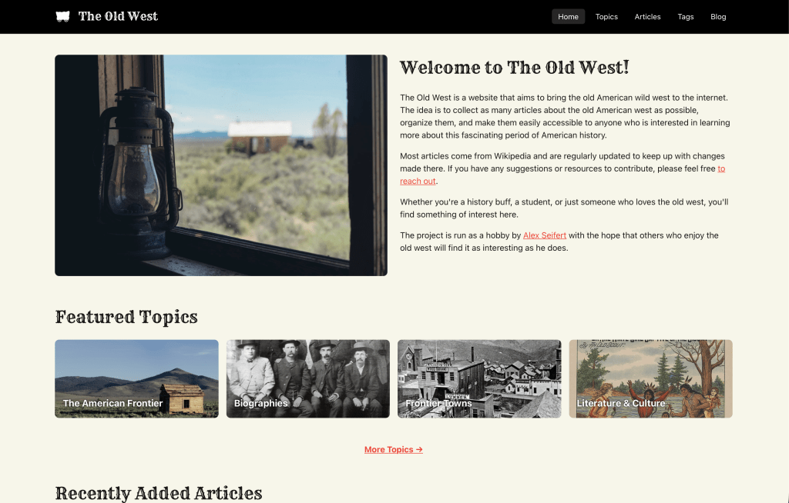

<figure><figcaption>The Old West in 2026</figcaption></figure>

Two days ago, I relaunched a website that [I first set up in 2021](https://blog.alexseifert.com/2021/04/19/the-old-west/) called [The Old West](https://www.the-old-west.com). It not only features a new design, but also a lot of new content. The purpose of the website is to consolidate Wikipedia articles about the old American west into one spot, making it easy to browse them. I import the articles into my database using Wikipedia’s API and display them under their [Creative Commons Attribution-ShareAlike License](https://en.wikipedia.org/wiki/Wikipedia:Copyrights). The articles are defined in config files and I wrote a script that imports and updates them. The script is run via a cronjob once a week to keep the articles up to date with the latest changes from Wikipedia.

A complete rewrite was long overdue as I could no longer build the old website. At the time, I was heavily into React and [Next.js](https://nextjs.org) which is the technology I chose to power the website. Unfortunately, I also used the [Material UI](https://mui.com/material-ui/) component library which became the main liability. Material UI released a major new update at some point and I *really* didn’t like their new approach to CSS handling and it would have basically required a major rewrite of the website. Therefore, I decided not to update. Of course, as time went on, the old version became incompatible with newer versions of React and Next.js and I got stuck with Next.js 12 which is several versions behind.

That by itself isn’t as much of an issue, however, Node itself also continued to move on and eventually, Next.js 12 no longer supported the version of Node I had installed locally. I’m aware I could have used [nvm](https://github.com/nvm-sh/nvm) combined with a specific Node version defined in a `.nvmrc` file at the root of the project, but that is more than I was willing to do to support the old, increasingly fragile technology powering the project. At that point, I had also become very disillusioned by React, Next.js and the general highly volatile Node ecosystem with its well-known dependency churn and increasing number of supply chain attacks.

So, when I decided to finally completely rewrite The Old West, I chose to go in a fully different direction with the technology. I chose vanilla PHP.

With so many shiny new programming languages and web frameworks on offer, why did I choose PHP? Well, I didn’t want dependencies. I wanted to write the code once, deploy it and be able to forget about it for years at a time even if it meant a little bit more work up front. My other requirement was that I still wanted to be able to update it at anytime without having to first spend hours trying to sort out dependency or runtime version incompatibilities just to get it to build again.

Vanilla PHP is not only perfect for that, but really the only feasible way to do it. Combined with Apache, Linux and MariaDB (the truly classic LAMP stack), it is practically bulletproof. No supply chain attacks, no version incompatibilities, no dependency update hell — nothing but stability and peace of mind.

PHP is incredibly backwards-compatible which means I can safely update the version on my server using my package manager and don’t have to worry about too many, if any updates to my code. The only “dependencies” I rely on are official PHP extensions such as PDO for database connectivity which I’m not concerned about because they are maintained and updated with PHP itself.

I wrote my own autoloader for namespaces, a tiny, fully custom router module, as well as a very lightweight ORM layer with an inheritable Model class, a QueryBuilder class, and a migration class that processes raw `.sql` files for migrations. Templating is handled with pure PHP. There is hardly any JavaScript on the website and I use pure CSS without anything like SCSS or Less. I do use the Bootstrap CSS classes for responsiveness, but I copied the CSS files into my project by hand which means they will work forever unless I feel like updating them.

That’s really all there is to it. The website is lightweight, lightning-fast, and entirely customized to my specific needs. It will run stably for as long as the server runs and even if the server craps out at some point, moving the project to another server requires minimal effort.

Vanilla PHP may not be glamorous, but it has been the stablest way to create a website for decades and, since it still powers the majority of the web, I think we can safely say it will remain that way for decades to come.

If you’d like to see the new design, you can find The Old West here: [www.the-old-west.com](https://www.the-old-west.com).