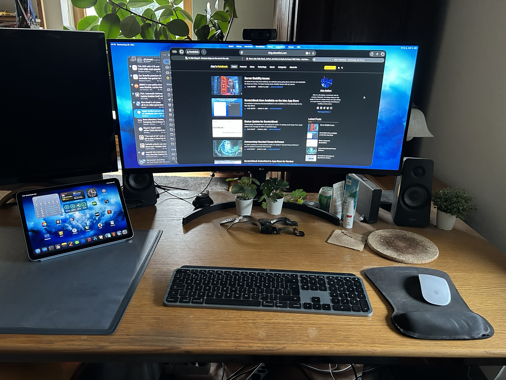

<figure><figcaption>My desk setup using my iPad Air M2 in desktop mode</figcaption></figure>

A couple of months ago, I took my 11″ iPad Air M2 with me to the city of Regensburg to try [working with it as a laptop replacement](https://blog.alexseifert.com/2026/01/26/trying-to-use-my-ipad-as-a-laptop-replacement/). Unfortunately, the tiny 11″ screen and the non-standard, smaller keyboard made it less than a stellar experience. However, I thought I could mitigate those problems while taking advantage of iPadOS 26’s new windowing feature by using a normal keyboard, mouse and a large external screen — essentially, turning it into a desktop replacement.

Equipment
---------

My equipment list for this experiment isn’t as exciting as it was for the laptop replacement experiment because I just used my usual desktop accessories:

-   Logitech MX Keys keyboard
-   Apple mouse
-   LG widescreen monitor that supports USB-C

Normally, I use a Logitech MX Master 3S mouse instead of the Apple mouse, but I’ve already used up all three device connections that it supports, so I had dig out my old Apple mouse. Otherwise, the most important part was the monitor with USB-C support. With that, I could just plug my iPad in and it not only activated external display mode, but importantly, it also charged.

My Experience
-------------

I know that the iPad is limited as to what it is capable of doing primarily due to the limitations of iPadOS. Development is nearly impossible on it which already means it’s not a viable desktop replacement for me full-time. However, I also write a lot, so I thought the best way to test it was to do some writing.

On my Mac, I use Pages anyway and most of it gets saved to iCloud Drive. As such, writing in Pages on the iPad means there isn’t really much of a change of workflow. I already knew that from when I tried using my iPad as a laptop replacement, but what I didn’t count on what the severe limitations I ran into when using the mouse and keyboard.

It turns out, unsurprisingly, that iPad apps are not optimized for them. That didn’t surprise me at all, but what did surprise me was just *how* limited it would be. Even first party-applications like Pages were severely restricted. For example, there is no way to correct a misspelled word with the mouse and keyboard. You have to use the touch screen to tap on the word that is underlined in red and then you get the popup menu with the spelling suggestions. There is absolutely not way to replicate that functionality with the mouse and keyboard which means I had to drag Pages from my big screen down to the iPad’s touch screen to use it — not a good experience at all.

Also, for some reason, forward delete doesn’t seem to work at all on the iPad. A full-size Mac keyboard has its own forward delete key and on the smaller Mac keyboards (such as on the MacBooks), you use fn+delete. Neither of those worked on the iPad at all which made trying to edit text much more tedious.

Even worse, though, were third-party apps. For example, I tried watching a YouTube video using the YouTube app. I could click on a video, but couldn’t exit it. There was literally no way to leave the video or access buttons like “Save” or “Like”. It just didn’t work at all. Again, I had to drag the app down to my iPad’s screen and use the touch interface.

The worst issue I kept encountering, though, was that the iPad would regularly crash entirely. As in, both screens would go black and there would be a loading spinner on the iPad’s screen that lasted for several seconds before I could use it again… except all of the apps I had open were closed. That happened with startling frequency even with only three of my most-used apps open: Mail, Safari and Pages. So much for windowed multitasking.

After this happened four times in a half an hour, I gave up on the experiment and went back to my Mac.

Conclusion
----------

Needless to say, I won’t be using my iPad as a desktop or laptop replacement anytime soon. After the experiment with trying to use the iPad as a laptop replacement, I went into this one less than optimistic. Unfortunately, my pessimism was confirmed by the experience.

I find it really disappointing that, despite the improvements Apple made to desktop mode in iPadOS 26, it still doesn’t even come close to being a viable, reliable option. Frankly, my iPad with its M2 processor is several times more powerful than my old Intel MacBook Pro, but the software cripples it to the point of irrelevance.

The idea of having a truly all-in-one, portable device is extremely appealing to me. I love using my iPad to read my RSS feeds, eBooks, articles online, magazines, etc which is what I primarily use it for. While I have an Apple Pencil, I rarely use it to take notes or draw anything. Unfortunately, unless Apple makes some major changes to iPadOS, it’s just going to remain a glorified electronic reader for me.